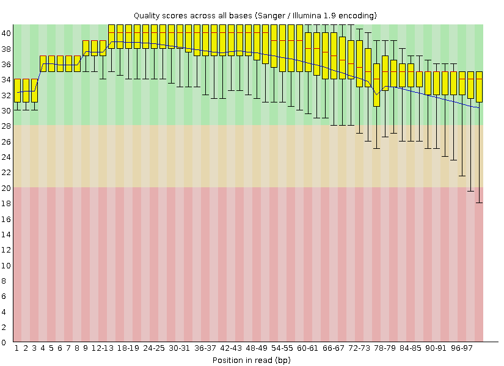

Download the fastq files from GEO.

Use fastqc to check the quality of the fastq files
```{bash}
fastqc -o output_path/fastQC/ -t 32 Tumor1_1.fastq.gz Tumor1_2.fastq.gz 
```



We can see that the quality per base dropped at the end of each action, that's because the activity of the enzyme dropped over time. The quality of the end of reverse sequencing file has a lower quartile less than 10. Those reads with quality score lower than 20 need to be filtered out. We will do this using samtools. 

Mapping the fastq data to the reference: will create a SAM file.
```{bash}
bwa mem -R '@RG\tID:groupT\tSM:sample1T\tPL:illumina\tLB:lib1\tPU:unit1' -t 15 -M -P reference_hg38_v0_Homo_sapiens_assembly38.fasta Tumor1_1.fastq.gz Tumor1_2.fastq.gz > Tumor1.sam

bwa mem -R '@RG\tID:groupN\tSM:sample1N\tPL:illumina\tLB:lib1\tPU:unit1' -t 15 -M -P reference_hg38_v0_Homo_sapiens_assembly38.fasta Germline1_1.fastq.gz Germline1_2.fastq.gz > Germline1.sam
```

-R '@RG' info (especially the SM/sample info) is required for the GATK to call somatic variations (against the germline)


Use samtools to convert to bam and sort
```{bash}
samtools view -b -q 20 -S Tumor1.sam -o Tumor1.bam -@15
samtools sort -o Tumor1_Sorted.bam Tumor1.bam -@15
samtools view -b -q 20 -S Germline1.sam -o Germline1.bam -@15
samtools sort -o Germline1_Sorted.bam Germline1.bam -@15
```
The paramiter "-q 20“ will filter out the reads with quality score lower than 20.


Use picard tool to mark duplicates in the sorted bam file
```{bash}
java -jar /home/fate/picard/build/libs/picard.jar MarkDuplicates \
    I=Tumor1_Sorted.bam \ 
    O=Tumor1_dedup.bam \
    M=Tumor1_dup_metrics.txt \
    CREATE_INDEX=true
```
The mapping algorithms that are used in the initial step of aligning the data to the reference are prone to various types of artifacts.The GATK programe can identifies intervals that need to be realigned, and can determine the optimal consensus sequence and performs the actual realignment of reads.
```{bash}
java -jar GenomeAnalysisTK.jar -T RealignerTargetCreator -R reference_hg38_v0_Homo_sapiens_assembly38.fasta -I Tumor1_dedup.bam -known gold_standard.indels.hg38.vcf -o Tumor1_target_intervals.list
```
This step will create a list of intervals that need realignment. The argument "-L chromosome:BP-range" can be used to set the target region of the genome. 


```{bash}
java -jar GenomeAnalysisTK.jar \
    -T IndelRealigner \
    -R reference_hg38_v0_Homo_sapiens_assembly38.fasta \
    -I Tumor1_dedup.bam \
    -Tumor1_target_intervals.list \
    -known gold_standard.indels.hg38.vcf \
    -o realigned_reads_Tumor1.bam
```
This step will perform realignment of the intervals from the last step.


Base quality score re-calibration (BQSR) 
```{bash}
java -jar GenomeAnalysisTK.jar \
    -T BaseRecalibrator \
    -R reference_hg38_v0_Homo_sapiens_assembly38.fasta \
    -I realigned_reads_Tumor1.bam \
    -knownSites Homo_sapiens_assembly38.dbsnp138.vcf \
    -knownSites gold_standard.indels.hg38.vcf \
    -o recal_Tumor1.grp
```
The per base quality score is critical for the variant calling algorithms. The estimates of the sequencing machines are often inaccurate.  This step generates a GATKReport file "recal_Tumor1.grp" contain the covariation data will be used for re-calibration of the base qualities.

```{bash}
java -jar GenomeAnalysisTK.jar \
  -T PrintReads \
  -R reference.fa \
  -I realigned_reads.bam \
  -BQSR recal_data.grp \
  -o recal_reads.bam
```
This step generates a "recal_reads.bam" file which contains all the original reads but with the re-calibrated quality scores. The original quality scores are discarded.


```{bash}
java -jar GenomeAnalysisTK.jar \
  -T HaplotypeCaller \
  -R reference.fa \
  -I recal_reads.bam \
  --genotyping_mode DISCOVERY \
  --output_mode EMIT_VARIANTS_ONLY \
  --stand_emit_conf 10 \
  --stand_call_conf 30 \
  -o raw_variants.vcf
```

欢迎使用 **{小书匠}(xiaoshujiang)编辑器**，您可以通过 `小书匠主按钮>模板` 里的模板管理来改变新建文章的内容。