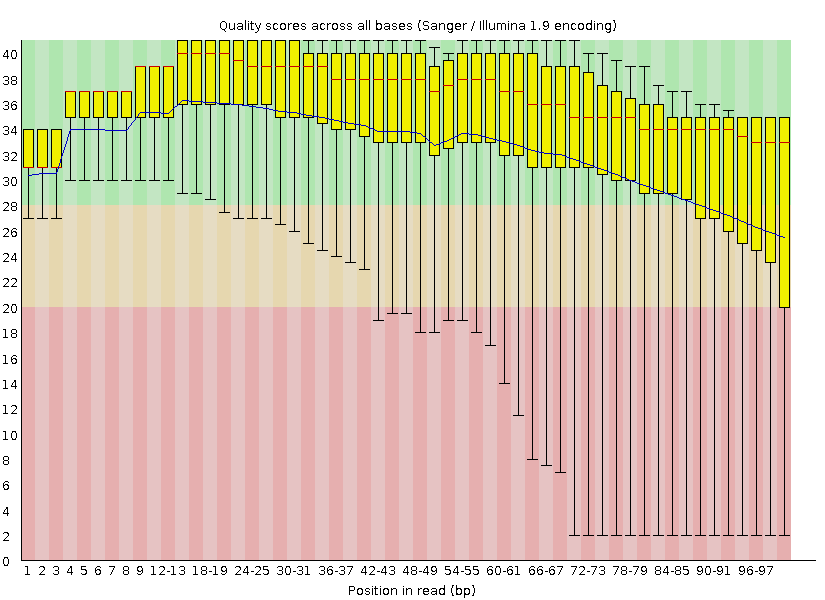

# Re-analysis of the nodal marginal zone lymphoma somatic variants from WES data

The original paper was published in 2013, the raw sequencing data is available on GEO. And the variant calling program they used in the paper is barely used by others. So it would be interesting to re-analyse this dataset.


## GATK Somatic variant discovery Workflow
Follow the tutorial of GATK website.


#### To generate analysis-ready reads BAM file
Download the fastq files from GEO.

Use fastqc to check the quality of the fastq files
```{bash}
fastqc -o output_path/fastQC/ -t 32 Tumor1_1.fastq.gz Tumor1_2.fastq.gz 
```



We can see that the quality per base dropped at the end of each action, that's because the activity of the enzyme dropped over time. The quality of the end of reverse sequencing file has a lower quartile less than 10. Those reads with quality score lower than 20 need to be filtered out. We will do this using samtools. 

Mapping the fastq data to the reference: will create a SAM file.
```{bash}
bwa mem -R '@RG\tID:groupT\tSM:sample1T\tPL:illumina\tLB:lib1\tPU:unit1' -t 15 -M -P reference_hg38_v0_Homo_sapiens_assembly38.fasta Tumor1_1.fastq.gz Tumor1_2.fastq.gz > Tumor1.sam

bwa mem -R '@RG\tID:groupN\tSM:sample1N\tPL:illumina\tLB:lib1\tPU:unit1' -t 15 -M -P reference_hg38_v0_Homo_sapiens_assembly38.fasta Germline1_1.fastq.gz Germline1_2.fastq.gz > Germline1.sam
```

-R '@RG' info (especially the SM/sample info) is required for the GATK to call somatic variations (against the germline)


Use samtools to convert to bam and sort
```{bash}
samtools view -b -q 20 -S Tumor1.sam -o Tumor1.bam -@15
samtools sort -o Tumor1_Sorted.bam Tumor1.bam -@15
samtools view -b -q 20 -S Germline1.sam -o Germline1.bam -@15
samtools sort -o Germline1_Sorted.bam Germline1.bam -@15
```
The paramiter "-q 20“ will filter out the reads with quality score lower than 20.


#### Use picard tool to mark duplicates in the sorted bam file
```{bash}
java -jar /home/fate/picard/build/libs/picard.jar MarkDuplicates \
     I=Tumor1_Sorted.bam \ 
     O=Tumor1_dedup.bam \
     M=Tumor1_dup_metrics.txt \
     CREATE_INDEX=true
```

#### Realign the reads

The mapping algorithms that are used in the initial step of aligning the data to the reference are prone to various types of artifacts.The GATK programe can identifies intervals that need to be realigned, and can determine the optimal consensus sequence and performs the actual realignment of reads.
```{bash}
java -jar GenomeAnalysisTK.jar \
     -T RealignerTargetCreator \
     -R reference_hg38_v0_Homo_sapiens_assembly38.fasta \
     -I Tumor1_dedup.bam \
     -known gold_standard.indels.hg38.vcf \
     -o Tumor1_target_intervals.list
```
This step will create a list of intervals that need realignment. The argument "-L chromosome:BP-range" can be used to set the target region of the genome. 


```{bash}
java -jar GenomeAnalysisTK.jar \
     -T IndelRealigner \
     -R reference_hg38_v0_Homo_sapiens_assembly38.fasta \
     -I Tumor1_dedup.bam \
     -Tumor1_target_intervals.list \
     -known gold_standard.indels.hg38.vcf \
     -o realigned_reads_Tumor1.bam
```
This step will perform realignment of the intervals from the last step.


#### Base quality score re-calibration (BQSR) 
```{bash}
java -jar GenomeAnalysisTK.jar \
     -T BaseRecalibrator \
     -R reference_hg38_v0_Homo_sapiens_assembly38.fasta \
     -I realigned_reads_Tumor1.bam \
     -knownSites Homo_sapiens_assembly38.dbsnp138.vcf \
     -knownSites gold_standard.indels.hg38.vcf \
     -o recal_Tumor1.grp
```
The per base quality score is critical for the variant calling algorithms. The estimates of the sequencing machines are often inaccurate.  This step generates a GATKReport file "recal_Tumor1.grp" contain the covariation data will be used for re-calibration of the base qualities.

```{bash}
java -jar GenomeAnalysisTK.jar \
     -T PrintReads \
     -R reference.fa \
     -I realigned_reads_Tumor1.bam \
     -BQSR recal_data.grp \
     -o recal_reads_Tumor1.bam
```

#### Re-calibrated quality scores
This step generates a "recal_reads.bam" file which contains all the original reads but with the re-calibrated quality scores. The original quality scores are discarded.


```{bash}
java -jar GenomeAnalysisTK.jar Mutect2  \
     -R reference.fa \
     -I recal_reads_Tumor1_dedup.bam \ # bam file from tumor sample
     -I recal_reads_Germline1_dedup.bam \ # bam file from germline sample
     -normal germline \   # indicated which input file is the germline control
     --germline-resource hg38_af-only-gnomad.hg38.vcf.gz \
     --pon somatic-hg38_1000g_pon.hg38.vcf.gz \
     --disable-read-filter MateOnSameContigOrNoMappedMateReadFilter \
     -O raw_somatic1.vcf \
     -bamout Tumor_normal1.bam  #Optional
```
Cause there is the matched germline data, so GATK Mutect2 will only call the somatic variants. The raw somatic variants are in the .vcf file. Mutect2 can also output a bam file containing the assembled haplotypes and locally realigned reads.

#### Filter out possible cross-sample contamination

```{bash}
java -jar GenomeAnalysisTK.jar GetPileupSummaries \
     -I recal_reads_Tumor1_dedup.bam \
     -V common_biallelic.vcf.gz \
     -L common_biallelic.vcf.gz \
     -O Tumor1_pileups.table
```
This step generates a tabulates metrics which summarizes the counts of reads, which can be used with cross contamination detection.


```{bash}
java -jar GenomeAnalysisTK.jar CalculateContamination \
     -I Tumor1_pileups.table \
     -matched Germline1_pileups.table \
     -O contamination1.table \
     -segments Tumor1_segments.tsv   #Optional: to output table containing segmentation of the tumor by minor allele fraction
```
From both (tumor and matched germline control) pileups tables, calculates the reads from cross-sample contamination. The result will be filtered out from the raw variants by FilterMutectCalls.


```{bash}
java -jar GenomeAnalysisTK.jar FilterMutectCalls \
     -R reference.fasta \
     -V somatic1.vcf.gz \
     --contamination-table contamination1.table \
     --tumor-segmentation Tumor1_segments.tsv \ #Optional
     -O filtered_somatic1.vcf.gz
```
Filter out the possible contaminated variants based on the result from the previous step.

#### Use ensembl VEP(Variant Effect Predictor) to predict the functional effects of genomic variants

```{bash}
vep -i filtered_somatic1.vcf.gz -o somatic1VEP.txt -offline 
```

#### Compare our results(upper) with the original results(lower).


The variant calling program they used in the paper is SAVI, which is not a common-use program. The GATK calls about 3 times more variants.


Reference:

1. GATK_Github https://github.com/broadinstitute/gatk
2. GATK Best Practices Workflows https://gatk.broadinstitute.org/hc/en-us/sections/360007226651-Best-Practices-Workflows
3. The genetics of nodal marginal zone lymphoma. Blood. 2016 Sep 8; 128(10): 1362–1373.
4. SAVI: a statistical algorithm for variant frequency identification. BMC Syst Biol
. 2013;7 Suppl 2(Suppl 2):S2. doi: 10.1186/1752-0509-7-S2-S2. Epub 2013 Oct 14
